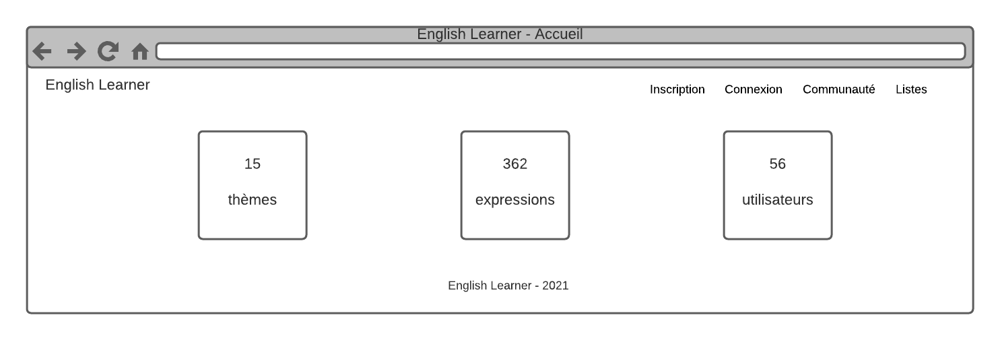
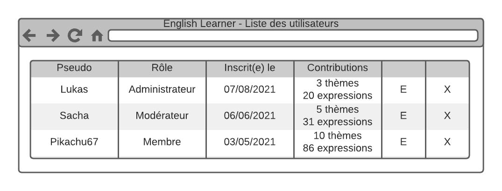
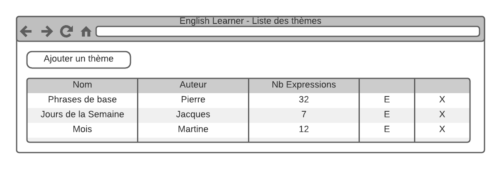
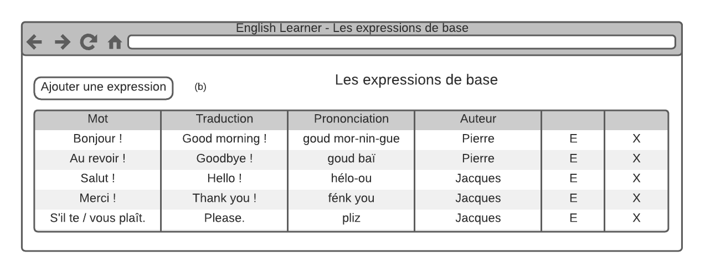
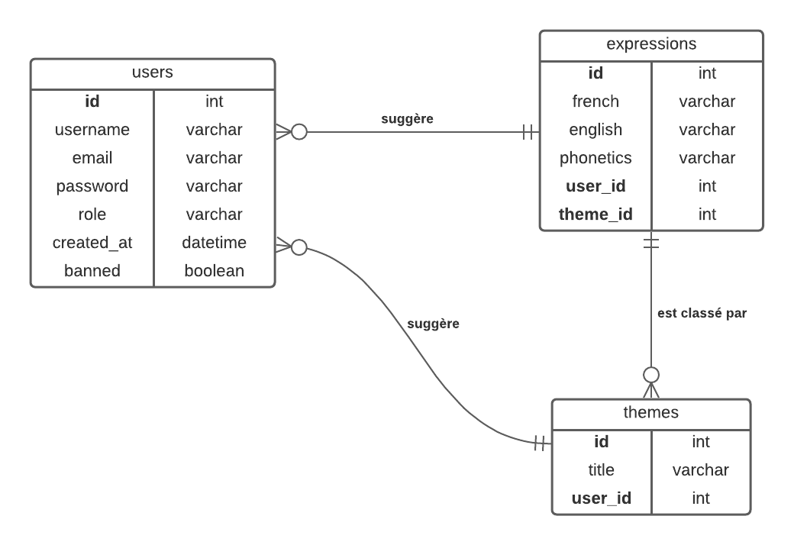

<style>
.page-break {
    page-break-after: always;
    break-after: page;
}
.content-title {
    font-size: 18px;
}
.doc-main-page {
    font-size: 36px;
    margin-top: 45%;
}
</style>

<div class="doc-main-page">
<p>Dossier de Synthèse - English Learner</p>
<p>Lucien HAMM</p>
<p>17 septembre 2021</p>
</div>

<div class="page-break"></div>

<div class="content-title">Table des matières</div>

[toc]

<div class="page-break"></div>

# Introduction

## Remerciements

Je tiens tout d'abord à remercier ma conseillère Pôle Emploi Delphine SIEGEL de m'avoir proposé cette formation de développeur web et mobile chez Elan Formation.

Sans cela, la suite de mon parcours de développeur n'aurait sûrement pas été la même.

Je tiens ensuite à remercier grandement les formateurs d'Elan Formation, à savoir Virgile GIBELLO et Mickaël MURMANN pour leur enseignement d'une qualité exceptionnelle en développement web et en gestion de projet, Cindy CAHEN pour aborder les bases du CMS Wordpress et de l'infographie, ainsi que Dominique DOPPLER et Stéphane SMAIL pour leurs précieux conseils sur la réalisation d'un CV pertinent et l'optimisation de notre recherche d'emploi.

Je remercie l'ensemble des membres de la promo DL10 2021 pour leur présence, leur humour, leur bienveillance et leurs encouragements.

Je remercie également mon tuteur Johan PASCAL de m'avoir accueilli en stage chez Indoor Santé et de m'avoir permis d'appréhender Flutter pour le développement d'applications mobiles.

Je remercie aussi mon collègue Joey MARTIN pour ses connaissances et sa précieuse aide pour la réalisation de mon projet de stage.

Dans tous les cas, je garderai un excellent souvenir de cette formation, qui restera la meilleure suivie à ce jour.

Il en est de même pour le stage, qui sera ma meilleure expérience professionnelle dans le domaine du développement mobile.

## Mon parcours de développeur

Si je devais résumer mon parcours de développeur, j'ai toujours été passionné par l'informatique, mais surtout le développement, et particulièrement le développement web.

Mon rêve d'enfant était d'être concepteur de jeux vidéos, étant moi-même un grand joueur par le passé.

Tout a commencé en 2006, à l'âge de 16 ans, où j'ai découvert l'existence de HTML, CSS et PHP sur le Site du Zéro.

Quelques années après, j'ai continué à m'auto-former sur ce même site dans d'autres langages comme C, C++ et Java.

J'abordais aussi d'autres langages comme JavaScript, Ruby, Python et C#.

En parallèle, je m'amusais à créer des ébauches de jeux de rôles avec RPG Maker 2003 et RPG Maker XP, d'où un certain intérêt pour Ruby et les scripts RGSS.

En septembre 2009, mon bac S obtenu, je m'oriente vers une filière math-info.

L'année suivante, je m'oriente vers l'IUT d'informatique d'Illkirch, où j'obtiens mon DUT en 2013.

Par la suite, j'ai laissé l'informatique de côté par intermittence, pour m'y retrouver en :
- exerçant le métier de développeur ERP sous Windev 18 en 2015 et 2016
- suivant une formation de développeur mobile de 3 mois en 2016
- exerçant le métier de téléconseiller web pour un hébergeur en 2017

Par après, j'ai exercé des missions d'intérim dans la logistique.

La dernière en date, entre octobre 2018 et juin 2020, durera plus d'un an et demi, en tant que préparateur de commandes de produits ophtalmologiques.

Ce métier m'aura appris à travailler avec rigueur, logique, efficacité et en équipe.

C'est suite à la fin de ma mission, compte tenu du contexte de l'année 2020, que j'ai envisagé de reprendre ma carrière de développeur web en main et de manière sérieuse.

J'ai aussi hésité à me réorienter vers le domaine de la data science avec Python.

J'ai finalement poursuivi avec cette présente formation en développement web et mobile chez Elan Formation.

Cette même formation m'aura apporté au mieux des connaissances en HTML, CSS, JS, PHP et Symfony, mais aussi sur la réalisation d'un projet et sa gestion, les bases de données et la construction d'un site basique avec Wordpress.

Je compte encore me former en autodidacte avec des sites de MOOCs comme Udemy, en ciblant des sujets précis comme Wordpress et React Native.

## Elan Formation

Elan Formation est un organisme de formation local, proposant des formations dans les domaines du développement web, de la bureautique, de la PAO, du multimédia, de l'infographie, d'Internet, du secrétariat, de la comptabilité, de la paye, de la vente et dans le secteur médical.

Leurs locaux sont présents dans la région Grand Est sur Strasbourg, Colmar, Haguenau, Metz, Mulhouse, Nancy, Saverne, Sélestat, Molsheim, Forbach, Wissembourg et Epinal, afin de dispenser des cours en présentiel.

La force d’Elan Formation est de proposer des cursus personnalisés et totalement individualisés aux
stagiaires, dans le but de leur remettre une attestation en fin de cycle.

<div class="page-break"></div>

# Le projet

L'idée de base du projet est une base de connaissance communautaire pour apprendre l'anglais avec des listes de vocabulaire, tout en facilitant l'apprentissage de la prononciation avec des indices phonétiques.

En effet, l'anglais est connu pour être une langue non phonétique, avec une difficulté axée sur la prononciation.

Il était aussi envisageable d'associer une expression à un fichier audio.

Cependant, cette solution pose quelques problèmes comme :
- la dépendance à un service externe, comme une API, qui peut s'avérer coûteuse au fil de son utilisation
- le problème des accents régionaux, qui peuvent altérer la prononciation d'une même expression
- les limites de l'efficacité du format audio, où la simple répétition d'une même expression ne suffit pas à en maîtriser sa prononciation

Il est donc jugé préférable de se baser sur des indices phonétiques pour des francophones, par des francophones.

Si l'on tient compte du poids international de la langue anglaise et de la variété des accents dans le monde, on en conclut que l'accent parfait n'existe pas.

L'essentiel est de maîtriser les bonnes bases de la prononciation et de se faire comprendre.

Dans notre cas, la prononciation sera basée sur l'anglais britannique.

Chaque expression (mot ou phrase) est classée par un thème et affichée avec sa traduction française et un indice de prononciation phonétique à la française.

Un thème peut être un sujet précis (comme les mois, les jours de la semaine et les fruits et légumes), mais aussi un ensemble d'exemples de phrases dans un contexte particulier (voyages, déplacements, conversations, présentations orales...).

L'application gère plusieurs utilisateurs et permet à chacun d'ajouter un nouveau thème et de nouvelles expressions, classées selon un thème, avec leur traduction et leur transcription phonétique.

Un utilisateur pourra aussi lancer un quiz sous forme de cartes mentales en recto-verso avec un nombre prédéfini par le nombre d'expressions d'un thème et le niveau de difficulté choisi.

Un modérateur aura pour rôle de gérer l'ensemble des thèmes et des expressions au besoin.

Il en sera de même pour un administrateur qui pourra aussi gérer les utilisateurs.

Les utilisateurs seront par ailleurs récompensés en nombre d'expressions et de thèmes publiés.

L'application s'inspire entres autres de [Memrise](https://www.memrise.com/fr/languages-online).

<div class="page-break"></div>

# Les compétences

Les compétences mises en oeuvre lors de la réalisation de ce projet se divisent en 2 parties :

## Le développement front-end

Il s'agit de la partie visible de l'application web côté client (ou navigateur).

Les compétences visées sont :
- le maquettage d'une application
- la réalisation d'une interface utilisateur web statique et adaptable
- le développement d'une interface utilisateur dynamique
- la réalisation d'une interface utilisateur avec une solution de gestion de contenu

## Le développement back-end

Il s'agit de la partie cachée de l'application web côté serveur.

Les compétences visées sont :
- la création d'une base de données
- le développement de composants d'accès aux données
- le développement de la partie administrative d'une application web ou web mobile
- l'élaboration et la mise en oeuvre des composants dans une application de gestion de contenu ou e-commerce

<div class="page-break"></div>

# Les outils

## La conception

### Ubuntu

Il s'agit d'un système d'exploitation basé sur Linux, libre, performant et pratique pour les développeurs.

L'utilisation de la console encouragée, sa grande communauté et l'installation d'outils en ligne de commande en font une de ces forces.

Dans mon cas, j'ai utilisé la version **Ubuntu 20.04 LTS Focal Fossa**.

### Visual Studio Code

Il s'agit d'un éditeur de textes très utile et performant.

On y trouve des fonctionnalités très intéressantes comme la coloration syntaxique et des extensions facilitant la vie du développeur comme :
- **Emmet**, qui facilite la saisie de balises HTML avec des raccourcis d'auto-complétion.
- **PHP Intellisense**, qui est une véritable boîte à outils intelligente du développeur PHP
- **Material Icon Theme**, qui ajoute des icônes pour les dossiers et des types de fichiers
- **PHP Getters & Setters**, qui ajoute des méthodes d'accès et de modification pour les attributs d'une classe en PHP

### XAMPServer

Il s'agit d'un ensemble d'outils permettant d'exécuter des scripts PHP côté serveur sur notre machine locale.

On y trouve trois serveurs (Apache, MySQL et MariaDB), un interpréteur de scripts PHP et l'outil d'administration phpMyAdmin pour les bases de données MySQL.

### LucidChart

Il s'agit d'un logiciel de création de diagrammes et de schémas polyvalent et très performant pour la réalisation de MCD (modèles conceptuels de données) et de maquettes.

## Le développement front-end

### HTML (HyperText Markup Language)

Il s'agit du langage de balisage utilisé pour définir la structure sémantique des pages d'un site.

C'est l'équivalent des murs pour une maison.

### CSS (Cascading Style Sheets)

Il s'agit du langage utilisé pour définir le style des éléments d'une page structurée par des balises HTML.

C'est l'équivalent de la décoration dans une maison.

### W3.CSS

Il s'agit d'un framework CSS minimaliste permettant de faciliter la définition du style des éléments d'une page avec des classes utilitaires prêtes à l'emploi.

Il est aussi possible de personaliser ce même framework avec une feuille de style à part.

### Google Fonts

Il s'agit d'une bibliothèque de polices d'écriture, aussi utilisée pour écrire des icônes.

### JS (JavaScript)

Il s'agit du langage orienté client dédié à la gestion des intéractions sur une page donnée comme :
- l'affichage d'une fenêtre modale pour confirmer la suppression d'une donnée
- le tri dynamique de données d'une liste selon une colonne
- la validation de champs d'un formulaire avant l'envoi de données

C'est aussi l'équivalent des éléments fonctionnels d'une maison, comme l'électricité et la plomberie.

## Le développement back-end

### PHP

Il s'agit d'un langage de programmation orienté serveur, libre et permettant la rélisation et la gestion de pages web dynamiques en HTTP.

### Twig

Il s'agit d'un moteur de template présentant des avantages comme :
- un code plus élégant et lisible
- un échappement automatique des caractères spéciaux et des balises HTML, pratique contre les failles XSS
- un héritage de templates, ou bases pour nos pages
- une intégration facilitée des variables
- des instructions de contrôles de flux (conditions, boucles)
- la séparation de parties en blocs (titre, contenu, feuilles de style, scripts JS)
- la création de composants réutilisables ou macros
- l'inclusion de parties (barre de navigation, pied de page)

### Composer

Il s'agit d'un gestionnaire de dépendances (ou composants) dédié aux projets PHP et très utilisé dans des frameworks PHP comme Symfony et Laravel.

Cet outil nous permet d'avoir des composants bien pratiques comme :
- l'autoloader, pour l'inclusion automatique de fichiers et la séparation du code en espaces de noms (ou namespaces)
- le moteur de templates Twig
- le gestionnaire de tests unitaires PHPUnit

### MySQL

Il s'agit d'un SGBD (système de gestion de bases de données) permettant de stocker, de manipuler et de gérer des informations dans une base de données.

Son avantage est son intégration à PHP par défaut et son utilisation facilitée par l'outil phpMyAdmin.

### PHPUnit

Il s'agit du framework de référence pour les tests automatisés en PHP.

### Maildev

Cet outil permet de tester l'envoi et la réception d'e-mails en local.

## La recherche

### La documentation officielle de PHP

Il s'agit de LA base de connaissance de tout développeur PHP qui se respecte.

### W3Schools

Une excellente alternative à la documentation officielle avec un bon nombre d'exemples pour apprendre le PHP et s'y perfectionner.

Ce site est également une ressource très utile en HTML, CSS et JS.

### Google

Il s'agit d'un moteur de recherches, aussi bien connu qu'utile.

### Stack Overflow

Il s'agit d'un forum de développeurs anglophone, où l'on trouve (très) souvent une réponse à une question bien précise.

On trouve aussi souvent des liens vers un message en tapant le résumé d'un problème ou un message d'erreur sur Google.

### YouTube

Il s'agit d'un hébergeur de vidéos bien connu, où l'on trouve à la fois toutes sortes de réponses utiles et de tutoriels pour s'améliorer.

<div class="page-break"></div>

# Le cahier des charges

## Les normes

### Le design responsive

Le design de l'application sera responsive, en s'adaptant à plusieurs tailles d'écran selon l'appareil d'un utilisateur (ordinateur, smartphone, tablette).

### La norme RGPD (Réglement Général de la Protection des Données)

Cette norme a pour but de responsabiliser les organismes traitant des données personnelles.

C'est à l'origine une directive européenne, transposée en 2018 en droit français.

Elle permet d’encadrer le traitement et la circulation des données à caractère personnel sur le territoire européen.

Ce règlement est obligatoire, et indique que les données personnelles doivent être :
- traitées de manière licite, loyale et transparente
- collectées à des fins déterminées, explicites et légitimes
- adéquates, pertinentes et limitées
- exactes et tenues à jour
- conservées pendant une durée raisonnable
- traitées de façon à garantir leur protection

Il est donc nécessaire de :
- définir une personne chargée de la protection des données (l'administrateur)
- lister les données et leur utilité
- repérer les données à risques et les protéger
- respecter le droit des utilisateurs concernant la collecte de leurs données, leur modification et leur suppression
- s’assurer que les sous-traitants respectent la norme RGPD

Dans le cas de cette application, les éléments suivants seront à prévoir :
- une page de **Mentions Légales** rappelant à l'utilisateur ses droits concernant ses données, leur édition et leur suppression
- la récolte d'informations essentielles et pertinentes pour un utilisateur, à savoir son pseudo et son adresse e-mail
- la sécurisation d'un mot de passe utilisateur avec une méthode de hachage
- un message d'information sur l'utilisation des cookies avec un bouton de validation

### La sécurité

L'application veillera à respecter certains principes de sécurité en incluant :
- des protections contre certaines failles (XSS, CSRF, DDoS, injections SQL...)
- un système de rôles (utilisateur, modérateur, administrateur) permettant un accès à certaines pages et fonctionnalités
- un système de hachage des mots de passe
- un système de vérification d'identité, permettant à un seul utilisateur d'accéder à ses données (consultation de profil, modification et suppression des suggestions et identifiants)
- une page de redirection en cas d'adresse invalide (erreur 404)

## Les éléments graphiques de base

**Base** : layout.twig

### Le menu de navigation

**Vue** : partials/navbar.twig

Un menu de navigation du site est visible tout en haut de chaque page et contient :
- le titre English Learner tout à gauche, avec un lien vers la page d'accueil
- les liens des différentes pages à droite dans cet ordre :
    - Inscription (si non connecté)
    - Connexion (si non connecté)
    - l'adresse e-mail d'un utilisateur connecté, avec un lien vers sa page de profil
    - Déconnexion (si connecté)
    - Communauté (liste des utilisateurs)
    - Listes (liste des thèmes)

### Le pied de page

**Vue** : partials/footer.twig

Un pied de page est visible tout en bas de chaque page avec la mention English Learner &copy; 2021 et un lien vers la page des **Mentions Légales**.

### Les messages d'alerte

**Vue** : partials/messages.twig

Les messages d'alerte (ou flash) s'affichent pour valider une action ou notifier une erreur comme :
- la confirmation d'une (dé)connexion
- un champ non valide dans un formulaire
- l'ajout d'un nouveau thème

## La page d'accueil

**Route** : / (**home**)

**Vue** : home.twig

**Contrôleur** : HomeController (index)

Il s'agit de la page principale, qui sert aussi de page d'affichage de statistiques avec :
- le nombre d'utilisateurs
- le nombre de thèmes
- le nombre d'expressions

Les statistiques sont affichées en blocs sur une même ligne.

Le premier bloc contient un lien vers la liste des utilisateurs.

Les autres blocs contiennent un lien vers la liste des thèmes.

## La gestion des utilisateurs

### L'inscription d'un nouvel utilisateur

**Route** : /register

**Vue** : users/register.twig

**Contrôleur** : UserController (register)

**Rôle** : invité

Un utilisateur doit s'inscrire s'il souhaite contribuer à la base de vocabulaire.

Il devra indiquer :
- son pseudo (requis, unique, alphanumérique, espaces inclus, sans accents, de 2 à 50 caractères)
- son adresse e-mail (requis, unique, e-mail valide, 180 caractères max)
- son mot de passe (requis, 8 à 32 caractères avec minuscules, majuscules et chiffres)
- sa confirmation du mot de passe

Des messages d'erreur s'afficheront en-dessous de chaque champ mal renseigné.

**Améliorations**

La validation du formulaire se fait en temps réel avec des messages indiquant les règles de validation de chaque champ.

Un mot de passe peut comporter des caractères spéciaux ($, @, !, ?).

Le formulaire de connexion s'affiche dans une fenêtre modale.

### La connexion d'un utilisateur

**Route** : /login

**Vue** : users/login.twig

**Contrôleur** : UserController (login)

**Rôle** : invité

Un utilisateur a le droit de se connecter suivant ces conditions :
- il n'a pas été banni par un administrateur
- son compte n'a pas été supprimé

Un utilisateur est invité à se connecter avec son e-mail et son mot de passe.

**Améliorations**

Le formulaire de connexion se trouve dans une fenêtre modale.

Un utilisateur peut demander un nouveau mot de passe si nécessaire en cliquant sur un lien **Mot de passe oublié**.

Il reçoit ensuite un e-mail avec son nouveau mot de passe.

### La déconnexion d'un utilisateur

**Route** : /logout

**Redirection** : / (**home**)

**Contrôleur** : UserController (logout)

**Rôle** : utilisateur

Un utilisateur peut se déconnecter en cliquant sur le lien **Déconnexion** du menu de navigation.

Il est ensuite redirigé vers la page d'accueil avec un message de confirmation.

### La page profil d'un utilisateur

**Route** : /profile/{id}

**Vue** : users/profile.twig

**Contrôleur** : UserController (profile)

**Rôle** : (même) utilisateur

Un utilisateur a accès à sa page de profil en cliquant sur son pseudo dans la barre de navigation principale.

Il y retrouve son nombre de thèmes et d'expressions suggérés.

Il peut aussi modifier ses identifiants.

Un premier formulaire lui permet de changer son e-mail et son pseudo.

L'e-mail et le pseudo doivent rester uniques.

Un second formulaire lui permet de changer son mot de passe en indiquant :
- son ancien mot de passe
- son nouveau mot de passe
- la confirmation de son nouveau mot de passe

**Améliorations**

La validation des formulaires se fait en temps réel.

### La liste des utilisateurs

**Route** : /users

**Vue** : users.twig

**Contrôleur** : UsersController (index)

Cette page liste l'ensemble des utilisateurs sous forme de tableau avec :
- le pseudo de l'utilisateur
- le rôle de l'utilisateur (Membre, Modérateur, Administrateur, Banni)
- la date d'inscription, au format JJ/MM/AAAA (ex : 21/06/2021)
- le nombre de thèmes
- le nombre d'expressions
- des boutons d'édition et de suppression (administrateur)

Le pseudo de l'utilisateur sera colorié :
- en vert, si c'est un modérateur
- en rouge, si c'est un administrateur

Un message s'affiche en cas d'absence d'utilisateur inscrit.

**Améliorations**

On peut choisir l'ordre d'affichage pour chaque colonne.

Les utilisateurs sont affichés par pages avec un nombre de 50 par défaut.

On peut choisir d'afficher 10, 20, 50, 100 ou 200 utilisateurs par page.

On peut filtrer l'ensemble des utilisateurs avec une barre de recherche.

### L'édition d'un utilisateur

**Route** : /users/{id}/update

**Vue** : users/edit_user.twig

**Redirection** : /users

**Contrôleur** : UserController (update)

**Rôle** : administrateur

Un administrateur est redirigé vers un formulaire d'édition d'un utilisateur avec :
- le rôle de l'utilisateur (membre, modérateur, administrateur)
- le statut de bannissement (case à cocher)

**Améliorations**

Le formulaire d'édition est intégré dans une fenêtre modale.

### La suppression d'un utilisateur

**Route** : /users/{id}/delete

**Vue** : users/delete_user.twig (*)

**Redirection** : /users

**Contrôleur** : UserController (delete)

**Rôle** : administrateur

Un administrateur déclenche une fenêtre modale (*) de confirmation de suppression de l'utilisateur concerné.

La suppression d'un utilisateur entraîne également la suppression de l'ensemble de ses thèmes et expressions.

## La gestion des thèmes

### La liste des thèmes

**Route** : /themes

**Vue** : themes.twig

**Contrôleur** : ThemeController (index)

Cette page liste l'ensemble des thèmes sous forme de tableau avec :
- le titre d'un thème, suivi de son lien
- l'auteur du thème
- le nombre d'expressions
- les boutons d'édition et de suppression (même utilisateur, modérateur et administrateur)

Un message s'affiche en cas d'absence de thème.

Un utilisateur connecté voit un bouton d'ajout au-dessus de la liste.

Un même utilisateur peut modifier et supprimer ses thèmes.

**Améliorations**

On peut choisir l'ordre d'affichage pour chaque colonne.

Les thèmes sont affichés par pages avec un nombre de 50 par défaut.

On peut choisir d'afficher 10, 20, 50, 100 ou 200 thèmes par page.

On peut filtrer l'ensemble des thèmes avec une barre de recherche.

### L'ajout d'un thème

**Route** : /themes/new

**Vue** : themes/new_theme.twig

**Redirection** : /themes

**Contrôleur** : ThemeController (create)

**Rôle** : (même) utilisateur

L'utilisateur est redirigé vers une page avec un formulaire incluant un champ pour le titre du nouveau thème.

**Améliorations**

Le formulaire d'ajout se trouve dans une fenêtre modale.

La validation du formulaire (titre obligatoire) se fait en temps réel.

### L'édition d'un thème

**Route** : /themes/{id}/edit

**Vue** : themes/edit_theme.twig

**Redirection** : /themes

**Contrôleur** : ThemeController (update)

**Rôle** : (même) utilisateur

Un modérateur, un administrateur ou un même utilisateur peut modifier un thème.

L'utilisateur est redirigé vers un formulaire avec un champ pré-rempli par l'ancien titre.

**Améliorations**

Le formulaire d'ajout se trouve dans une fenêtre modale.

La validation du formulaire (titre obligatoire) se fait en temps réel.

### La suppression d'un thème

**Route** : /themes/{id}/delete

**Vue** : themes/delete_theme.twig (*)

**Redirection** : /themes

**Contrôleur** : ThemeController (delete)

**Rôle** : (même) utilisateur

Un modérateur, un administrateur ou un même utilisateur peut supprimer un thème.

Une fenêtre modale (*) s'affiche pour confirmer la suppression du thème.

La suppression d'un thème entraîne également la suppression de l'ensemble de ses expressions.

## La gestion des expressions

### La liste des expressions d'un thème

**Route** : /themes/{id}/show

**Vue** : themes/show_theme.twig

**Contrôleur** : ThemeController (show)

Cette page liste l'ensemble des expressions d'un thème sous forme de tableau avec :
- l'expression en français
- la traduction en anglais
- la transcription phonétique
- l'auteur de l'expression
- les boutons d'édition et de suppression (modérateur, administrateur ou même utilisateur)

Un utilisateur connecté voit un bouton d'ajout au-dessus de la liste.

Un message s'affiche en cas d'absence d'expression.

**Améliorations**

On peut choisir l'ordre d'affichage pour chaque colonne.

On peut choisir d'afficher 10, 20, 50, 100 ou 200 expressions par page.

On peut aussi filtrer l'ensemble des thèmes avec une barre de recherche.

### La génération de flashcards d'un thème

**Route** : /themes/{id}/start

**Vue** : themes/game.twig

**Redirection** : /themes/{id}/show

**Contrôleur** : ThemeController (start)

**Rôle** : utilisateur

Un utilisateur peut lancer une partie de flashcards recto-verso sur la page d'un même thème, à partir de 10 expressions.

Il déclenche une fenêtre modale qui l'invite à choisir un niveau de difficulté qui déterminera le nombre d'expressions : facile (10), moyen (15) et difficile (20).

Il est ensuite invité à se remémorer la traduction anglaise de chaque expression affichée avant d'obtenir la réponse en un clic et de passer à la question suivante.

Les questions sont générées de manière aléatoire selon le nombre disponible et le niveau de difficulté.

La réponse est affichée avec un effet de retournement horizontal.

Une fois le jeu terminé, l'utilisateur est invité à rejouer s'il le souhaite.

### L'ajout d'une expression

**Route** : /expressions/new

**Vue** : expressions/new_expression.twig

**Redirection** : /expressions

**Contrôleur** : ExpressionController (create)

**Rôle** : utilisateur

L'utilisateur est redirigé vers une page avec un formulaire incluant :
- un champ texte pour l'expression en français
- un champ texte pour la traduction en anglais
- un champ texte pour la transcription phonétique

**Améliorations**

Le formulaire d'ajout se trouve dans une fenêtre modale.

La validation du formulaire se fait en temps réel.

### L'édition d'une expression

**Route** : /expressions/{id}/edit

**Vue** : expressions/edit_expression.twig

**Redirection** : /themes/{id}/show

**Contrôleur** : ExpressionController (update)

**Rôle** : (même) utilisateur

Un modérateur, un administrateur ou un même utilisateur peut modifier une expression.

L'utilisateur est redirigé vers un formulaire incluant :
- un champ texte pré-rempli avec l'expression en français
- un champ texte pré-rempli avec la traduction en anglais
- un champ texte pré-rempli avec la transcription phonétique

**Améliorations**

Le formulaire d'édition se trouve dans une fenêtre modale.

La validation du formulaire (champs obligatoires) se fait en temps réel.

### La suppression d'une expression

**Route** : /expressions/{id}/delete

**Vue** : expressions/delete_expression.twig

**Redirection** : /themes/{id}/show

**Contrôleur** : ExpressionController (delete)

**Rôle** : (même) utilisateur

Un modérateur, un administrateur ou un même utilisateur peut supprimer une expression.

Une fenêtre modale s'affiche pour confirmer la suppression d'une expression.

# La conception

## L'interface graphique

L'application comporte plusieurs types de pages, à savoir :
- la page d'accueil
- la liste des utilisateurs
- la liste des thèmes
- la liste des expressions d'un thème
- les formulaires des utilisateurs (inscription, connexion, profil)
- les formulaires d'ajout, d'édition et de suppression

En voici quelques aperçus :

### La page d'accueil



### La liste des utilisateurs



### La liste des thèmes



### La liste des expressions d'un thème



## La base de données

La base de données de l'application est définie selon le modèle suivant :



Elle se résume ainsi en trois tables :

### Les utilisateurs (users)

Un utilisateur publie aucune ou plusieurs thèmes. (0,n)

Un utilisateur publie aucune ou plusieurs expressions. (0,n)

|||
|-|-|
|**id**|l'identifiant d'un utilisateur|
|**username**|le pseudo d'un utilisateur|
|**email**|l'adresse e-mail d'un utilisateur|
|**password**|le mot de passe d'un utilisateur|
|**role**|le rôle d'un utilisateur (user, admin, moderator)|
|**created_at**|la date d'inscription d'un utilisateur (au format JJ/MM/AAAA)|
|**banned**|le statut de bannissement d'un utilisateur|

### Les thèmes

Un thème appartient à un seul utilisateur. (1,1)

Un thème contient aucune ou plusieurs expressions. (0,n)

|||
|-|-|
|**id**|l'identifiant d'un thème|
|**title**|le titre d'un thème|
|**user_id**|l'identifiant d'un utilisateur|

### Les expressions

Une expression appartient à un seul utilisateur. (1,1)

Une expression est classée dans un seul thème. (1,1)

|||
|-|-|
|**id**|l'identifiant d'une expression|
|**french**|l'expression en français|
|**english**|la traduction en anglais|
|**phonetics**|la transcription phonétique|
|**user_id**|l'identifiant d'un utilisateur|
|**theme_id**|l'identifiant d'un thème|


# L'architecture

Le framework est entièrement personnalisé pour des raisons de maîtrise de code et de mise en pratique du langage PHP et de la programmation orientée objet.

Il se base par ailleurs sur l'architecture **MVC** (Modèle Vue Contrôleur).

## Les couches du modèle MVC


### Le modèle

La couche **Modèle** gère les données de l'application avec des classes, aussi appelées entités.

Son rôle consiste à récupérer les informations dans la base de données, de les organiser et de les assembler pour être traitées par le contrôleur.

Chaque modèle correspond à une table.

Voici un exemple avec le modèle Theme :

```php
include model-theme
```

### La vue

La couche **Vue** est la partie visible de l'application, affichée côté client ou dans un navigateur.

Le langage de templating utilisé est Twig.

Voici un exemple avec la liste des thèmes :

```php
include vue-themes
```

### Le contrôleur

La couche **Contrôleur** permet de faire le lien entre la **vue** et le **modèle**, avec l'aide du **routeur**.

Le routeur gère une route existante avec des paramètres validés, et appelle ensuite la fonction correspondante du contrôleur.

Cette partie est le coeur du code et de la logique de l'application.

Voici un exemple pour l'affichage des thèmes :

```php
include controleur-themes
```

## La structure du framework

Le framework se divise en plusieurs dossiers :
- controllers
- core
- database
- models
- public
- tests

### Le dossier controllers

Il regroupe les contrôleurs du framework.

|||
|-|-|
|**HomeController.php**|la redirection vers la page d'accueil|
|**NotFoundController.php**|la redirection vers la page d'erreur 404 (adresse invalide)|
|**ThemeController.php**|la gestion des thèmes|
|**UserController.php**|la gestion des utilisateurs|

### Le dossier core

Il regroupe le coeur du fonctionnement du framework avec des classes et des fonctions utilitaires.

|||
|-|-|
|**Controller.php**|la classe de base des contrôleurs|
|**Cookie.php**|la classe utilitaire des cookies|
|**Database.php**|la classe utilitaire de l'objet **PDO** (**PHP D**ata **O**bject) pour la connexion à la base de données|
|**Get.php**|la classe utilitaire de la méthode **GET**|
|**Model.php**|la classe de base des modèles|
|**Post.php**|la classe utilitaire de la méthode **POST**|
|**RandomString.php**|la classe utilitaire des chaînes de caractères aléatoires pour les tokens CSRF et les tests|
|**Router.php**|la classe utilitaire du routeur|
|**Session.php**|la classe utilitaire de la session|
|**Validator.php**|la classe utilitaire de la validation des formulaires|

Les classes utilitaires se basent sur des méthodes statiques.

```php
$fakeUsername = RandomString::fakeString(15);
```

### Le dossier database

Il regroupe un ensemble de fichiers CSV pour remplir la base de données avec des valeurs de test et le script **seeder.php**.

### Le dossier model

Il regroupe les modèles.

|||
|-|-|
|**Expression.php**|la classe modèle de la table des expressions|
|**Theme.php**|la classe modèle de la table des thèmes|
|**User.php**|la classe modèle de la table des utilisateurs|

### Le dossier public

Il regroupe le fichier de base **index.php** suivi de l'ensemble des vues au format Twig, des images, des feuilles de style CSS et des scripts JS.

### Le dossier public/views

Ce dossier regroupe l'ensemble des vues avec les pages de base :

|||
|-|-|
|**layout.twig**|le modèle de base de l'interface graphique|
|**home.twig**|la page d'accueil|

On retrouve ensuite les dossiers suivants :

|||
|-|-|
|**errors**|les pages d'erreur (404)|
|**expressions**|les pages des expressions (ajout, édition et suppression)|
|**partials**|les composants récurrents (barre de navigation, pied de page, messages flash)|
|**themes**|les pages des thèmes|
|**users**|les pages des utilisateurs|

### Le dossier tests

Il regroupe l'ensemble des classes de tests automatisés.

|||
|-|-|
|**ExpressionTest.php**|tests des fonctions liées à la table des expressions|
|**ThemeTest.php**|tests des fonctions liées à la table des thèmes|
|**UserTest.php**|tests des fonctions liées à la table des utilisateurs|

<div class="page-break"></div>

# La sécurité

Le framework a été conçu pour respecter des principes de sécurité et ainsi éviter certaines failles.

## Les mots de passe

Le mot de passe d'un utilisateur est automatiquement haché selon la méthode **BCrypt** lors de sa création.

```php
// Cryptage des mots de passe

public static function hash($string) {
    return password_hash($string, PASSWORD_BCRYPT);
}
```

## La faille XSS (Cross-Site Scripting)

Cette faille permet l'injection de code HTML ou JavaScript dans le champ d'un formulaire pour récupérer des données.

On doit ainsi veiller à transformer les caractères spéciaux, voire à les interdire avant la validation du formulaire, grâce à des expressions régulières et des fonctions natives.

Voici un exemple avec la fonction **clean()** de la classe utilitaire **RandomString** :

```php
abstract class Security {
    // Nettoyage des caractères spéciaux (XSS)

    public static function clean($string) {
        $string = trim($string);
        $string = stripslashes($string);
        $string = htmlspecialchars($string);

        return $string;
    }

    ...
}
```

## La faille DDoS (Denial of Service Attack)

Une attaque DDoS consiste à envoyer de multiples requêtes sur une même page dans le but d'entraver la capacité d'un site ou d'une application web.

L'intérêt d'une ligne comme `sleep(1);` est de ralentir volontairement un utilisateur malintentionné, en multipliant le nombre de requêtes par 1 000 pour une seconde.

## L'injection SQL

Une injection SQL consiste à modifier une requête envoyée à la base de données pour en détourner l'utilisation et ainsi récupérer des informations, comme le mot de passe d'un administrateur.

Des fonctions natives permettent de protéger les requêtes définies selon des variables.

Voici un extrait de fonction de construction d'une requête :

```php
// Sélection d'une ligne par un attribut

public function findBy($attribute, $value) {
    $statement = $this->dbHandler
                        ->prepare("SELECT * FROM :table
                                    WHERE :attribute = :value");

    $statement->bindValue(":table", $this->tableName);
    $statement->bindValue(":attribute", $attribute);
    $statement->bindValue(":value", $value);
    
    $statement->execute();

    $statement->closeCursor();

    return $statement->fetch(\PDO::FETCH_OBJ);
}
```

## La faille CSRF (Cross Site Request Forgery)

Cette faille consiste à voler la session d'un utilisateur pour exécuter des actions à son insu.

On peut ainsi imaginer un utilisateur voler la session d'un administrateur et prendre son rôle.

Le meilleur moyen de s'en prémunir est de gérer l'authentification avec un jeton, aussi appelé **token**.

Ce même jeton est vérifié à chaque modification dans un formulaire.

Voici une illustration en deux fonctions :

```php
// Génération d'un token CSRF (session)

public static function setToken() {
    self::start();

    $_SESSION["token"] = bin2hex(random_bytes(50));
}

// Correspondance du jeton CSRF

public static function checkCSRF() {
    return $_POST["token"] == $_SESSION["token"];
}
```

<div class="page-break"></div>

# Extraits de code

Voici quelques extraits de code supplémentaires pour détailler certaines parties de l'application :

## public > index.php

Il s'agit de la page de base de l'application.

On y initialise le routeur.

```php
// Importation de la classe du routeur

use app\core\Router;

// Gestion (automatique) des espaces de noms (ou namespaces)

require_once "../../vendor/autoload.php";

// Initialisation du routeur

Router::init();
```

## public > views > layout.twig

Il s'agit de la page de définition de l'interface graphique en Twig.

```html
<!DOCTYPE html>
<html lang="fr">
    <head>
        <meta charset="UTF-8">
        <meta http-equiv="X-UA-Compatible" content="IE=edge">
        <meta name="viewport" content="width=device-width, initial-scale=1.0">

        {# Styles #}

        <link rel="stylesheet" href="{{ public }}/css/font-awesome.min.css">

        <link rel="preconnect" href="https://fonts.googleapis.com">
        <link rel="preconnect" href="https://fonts.gstatic.com" crossorigin>
        
        <link href="https://fonts.googleapis.com/css2?family=Lato:wght@400&display=swap" rel="stylesheet">

        <link href="{{ public }}/css/w3.css" rel="stylesheet">
        <link href="{{ public }}/css/style.css" rel="stylesheet">

        
        

        {# Title #}

        <title>English Learner - </title>
    </head>

    <body>
        {# Navigation #}

        

        {# Main #}

        <main class="w3-container">
            <noscript>
                <h3 class="w3-text-red">JavaScript doit être activé pour accéder à l'ensemble des fonctionnalités.</h3>
            </noscript>

            {# Flash Messages #}

            

            {# Content #}

            
            
        </main>

        {# Footer #}

        

        {# Scripts #}

        <script src="{{ public }}/js/navbar.js"></script>

        
        
    </body>
</html>
```

## models > Theme.php

Il s'agit de la classe modèle de la table des thèmes, avec une définition des requêtes.

En voici des exemples :

```php
class Theme extends Model {
    // Sélection d'un thème par le titre

    public function findByTitle($title) {
        return $this->findBy("title", $title);
    }

    // Expressions d'un thème

    public function findExpressions($themeId) {
        $statement = $this->dbHandler
                            ->prepare("
                                SELECT e.*
                                FROM expressions e, themes t
                                WHERE e.theme_id = t.id
                                AND t.id = :id
                            ");

        $statement->bindValue(":id", $themeId);

        $statement->execute();

        $statement->closeCursor();

        return $statement->fetchAll(\PDO::FETCH_OBJ);
    }

    ...
}
```

## controllers > HomeController.php

Il s'agit du contrôleur de la page d'accueil, où on définit le nombre d'utilisateurs, de thèmes et d'expressions.

```php
namespace app\controllers;

use app\core\Session;

use app\models\User;
use app\models\Theme;
use app\models\Expression;

use app\controllers\Controller;

class HomeController extends Controller {
    private $userModel;
    private $themeModel;
    private $expressionModel;

    // Constructeur

    public function __construct() {
        $this->init();

        $this->userModel = new User();
        $this->themeModel = new Theme();
        $this->expressionModel = new Expression();
    }

    // Page d'accueil

    public function index() {
        // Stats

        $nbUsers = $this->userModel->count();
        $nbThemes = $this->themeModel->count();
        $nbExpressions = $this->expressionModel->count();

        // Rendu

        echo $this->twig->render("home.twig", [
            "session" => Session::all(),
            
            "title"         => "Accueil",
            "nbUsers"       => $nbUsers,
            "nbThemes"      => $nbThemes,
            "nbExpressions" => $nbExpressions
        ]);
    }
}
```

# Les axes d'améliorations

Il me reste à revoir certains aspects comme :
- l'intégration de fenêtres modales pour la connexion, l'inscription, l'ajout, l'édition et la suppression de données
- la validation des formulaires en temps réel
- l'affichage de données par pages et filtres de recherche
- la réinitialisation du mot de passe d'un utilisateur avec envoi par e-mail
- le développement du jeu de flashcards aléatoires d'un thème


