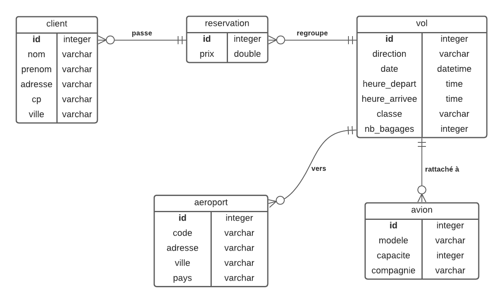

# Ex Airport - Lucien HAMM

## 1) Base de données



### Tables

**client**

|champ|type|
|-|-|
|**id**|integer|
|nom|varchar|
|prenom|varchar|
|adresse|varchar|
|cp|varchar|
|ville|varchar|

**aeroport**

|champ|type|exemple|
|-|-|-|
|**id**|integer||
|code|varchar (3)|SBX|
|adresse|varchar|route de l'aéroport|
|ville|varchar|Strasbourg|
|pays|varchar|FRANCE|

**avion**

|champ|type|exemple|
|-|-|-|
|**id**|integer||
|modele|varchar|EJ-78945|
|capacite|integer|200|
|compagnie|varchar|easyJet|

**vol**

|champ|type|exemple|
|-|-|-|
|**id**|integer|4800|
|direction|varchar (6)|aller, retour|
|date|datetime|samedi 14/09|
|heure_depart|time|06:00|
|heure_arrivee|time|7 h 50|
|classe|varchar|économique, business|
|nb_bagages|integer||
|**reservation_id**|integer||
|**aeroport_id**|integer||
|**avion_id**|integer||

**reservation**

|champ|type|exemple|
|-|-|-|
|**id**|integer|456789|
|prix|varchar|90 (€ TTC)|
|**client_id**|integer||

### Relations

**client - reservation**

Un client passe aucune ou plusieurs réservations. (0,n)

Une réservation est passée par un seul client. (1,1)

**reservation - vol**

Une réservation regroupe aucun ou plusieurs vols. (0,n)

Un vol concerne une seule réservation. (1,1)

**vol - avion**

Un vol est rattaché à un seul avion. (1,1)

Un avion est utilisé pour aucun ou plusieurs vols. (0,n)

**vol - aeroport**

Un vol est à destination d'un seul aéroport. (1,1)

Un aéroport est rattaché à aucun ou plusieurs vols. (0,n)

## Ex 1

```sql
CREATE TABLE IF NOT EXISTS client (
    id INTEGER PRIMARY KEY AUTO_INCREMENT,
    nom VARCHAR(50) NOT NULL,
    prenom VARCHAR(50) NOT NULL,
    adresse VARCHAR(255) NOT NULL,
    cp VARCHAR(10) NOT NULL,
    ville VARCHAR(100) NOT NULL
);

CREATE TABLE IF NOT EXISTS reservation (
    id INTEGER PRIMARY KEY AUTO_INCREMENT,
    prix FLOAT NOT NULL,
    client_id INTEGER NOT NULL,
    FOREIGN KEY (client_id) REFERENCES client (id)
);

CREATE TABLE IF NOT EXISTS avion (
    id INTEGER PRIMARY KEY AUTO_INCREMENT,
    modele VARCHAR(20) NOT NULL,
    capacite INTEGER NOT NULL,
    compagnie VARCHAR(30) NOT NULL
);

CREATE TABLE IF NOT EXISTS aeroport (
    id INTEGER PRIMARY KEY AUTO_INCREMENT,
    code VARCHAR(3) NOT NULL,
    adresse VARCHAR(255) NOT NULL,
    ville VARCHAR(100) NOT NULL,
    pays VARCHAR(50) NOT NULL
);

CREATE TABLE IF NOT EXISTS vol (
    id INTEGER PRIMARY KEY AUTO_INCREMENT,
    direction VARCHAR(10) NOT NULL,
    `date` DATE DEFAULT CURRENT_TIMESTAMP,
    heure TIME NOT NULL,
    classe VARCHAR(15) NOT NULL,
    nb_bagages INTEGER NOT NULL,
    avion_id INTEGER NOT NULL,
    aeroport_id INTEGER NOT NULL,
    reservation_id INTEGER NOT NULL,
    FOREIGN KEY (avion_id) REFERENCES avion (id),
    FOREIGN KEY (aeroport_id) REFERENCES aeroport (id),
    FOREIGN KEY (reservation_id) REFERENCES reservation (id)
);
```

## Ex 2

### 2a)

Requête pour les informations concernant le client

```sql
SELECT c.*
FROM client c, reservation r
WHERE c.id = r.client_id
AND reservation_id = 456789
```

### 2b)

Requête pour les informations concernant le vol aller et retour (n°vol, date + heure départ et arrivée, aéroports, informations de l’avion concerné et classe choisie par le client + prix)

Le montant total de la réservation est calculé ultérieurement.

```sql
SELECT v.id, v.date, v.heure_depart, v.heure_arrivee, a.*, v.classe, r.prix
FROM vol v, aeroport ar, avion av, reservation r
WHERE v.aeroport_id = ar.id
AND v.avion_id = av.id
AND v.reservation_id = r.id
AND r.id = 456789
```

## Ex 3

Ecrire la requête SQL qui permet de savoir combien de passagers ont réservé le vol aller ci-dessus.

Dans une 2e requête, lister la liste des passagers (nom, prénom) de ce vol triés par nom de famille de A à Z.

Dans une 3e requête, lister ces mêmes passagers mais uniquement ceux dont le nom de famille termine par la particule "LAN".

```sql
SELECT COUNT(c.id)
FROM client c, vol v, reservation r
WHERE v.reservation_id = r.id
AND r.client_id = c.id
AND v.id = 4800;

SELECT c.nom, c.prenom
FROM client c, vol v, reservation r
WHERE v.reservation_id = r.id
AND r.client_id = c.id
AND v.id = 4800
ORDER BY c.nom ASC;

SELECT c.nom, c.prenom
FROM client c, vol v, reservation r
WHERE v.reservation_id = r.id
AND r.client_id = c.id
AND v.id = 4800
AND c.nom LIKE '%LAN';
```

## Ex 4

Ecrire la requête SQL qui permet de savoir combien de vols sont prévus via la compagnie aérienne EasyJet durant le mois de septembre

```sql
SELECT COUNT(v.id)
FROM vol v, avion a
WHERE v.avion = a.id
AND a.compagnie = 'EasyJet'
AND MONTH(v.date) = 9
```

## Ex 5

Ecrire la requête SQL qui affiche la liste des 10 prochains vols au départ de l’aéroport de Strasbourg SXB (à partir de l’heure courante) triés du plus proche au plus éloigné

```sql
SELECT v.*
FROM vol v, aeroport a
WHERE v.aeroport_id = a.id
AND a.code = 'SBX'
AND v.date = DATE(NOW())
ORDER BY DATE_FORMAT(v.date, '%H') ASC
LIMIT 10
```

## Ex 6

On admet que la fonction SQL TIMEDIFF(heure1, heure2) calcule la différence HH:MM entre 2 heures, écrire les requêtes SQL qui calculent la durée du trajet aller et retour des vols de la question 2. (sachant que les 2 vols sont rattachés au même numéro de réservation).

```sql
SELECT TIMEDIFF(v.heure_depart, v.heure_arrivee)
FROM vol v, reservation r
WHERE v.reservation_id = r.id
AND r.id = 456789
```

## Ex 7

Modifiez votre MCD de façon à gérer le nombre de bagages en soute que le passager emmène lors de son vol (le nombre de bagages en soute peut être différent à l’aller et au retour).

cf MCD

## Ex 8

Grâce à une requête SQL, insérer un nouveau client dans votre base de données.

```sql
INSERT INTO client(nom, prenom, adresse, cp, ville) VALUES('WAYNE', 'Bruce', '1 rue de la justice', 'GOTHAM', '99999')
```

