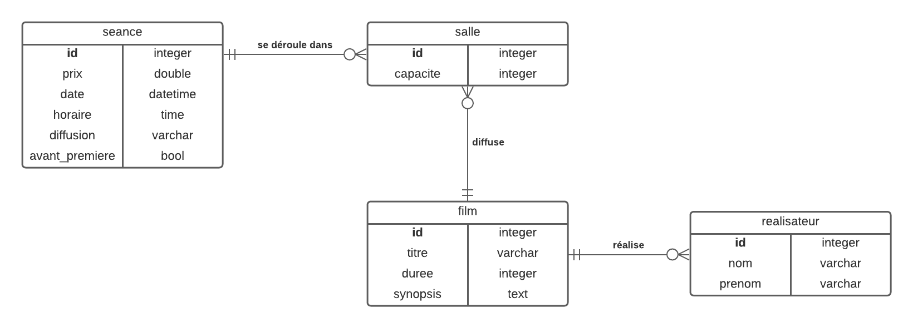

# Ex Cinema - Lucien HAMM



## Base de données

### Tables

**salle**

|champ|type|
|-|-|
|**id**|integer|
|capacité|integer|

**film**

|champ|type|
|-|-|
|**id**|integer|
|titre|varchar|
|duree|integer|
|synopsis|text|
|**salle_id**|integer|
|**realisateur_id**|integer|

**realisateur**

|champ|type|
|-|-|
|**id**|integer|
|nom|varchar|
|prenom|varchar|

**seance**

|champ|type|
|-|-|
|**id**|integer|
|prix|double|
|date|datetime|
|horaire|time|
|diffusion|varchar|
|avant_premiere|bool|
|**salle_id**|integer|

### Relations

**seance - salle**

Une salle concerne aucune ou plusieurs séances. (0,n)

Une séance se déroule dans une seule salle. (1,1)

**salle - film**

Une salle diffuse aucun ou plusieurs films. (0,n)

Un film est diffusé dans une seule salle. (1,1)

**film - realisateur**

Un film est réalisé par un seul réalisateur. (1,1)

Un réalisateur réalise aucun ou plusieurs films. (0,n)

```sql
CREATE TABLE IF NOT EXISTS salle (
    id INTEGER PRIMARY KEY AUTO_INCREMENT,
    capacite INTEGER NOT NULL
);

CREATE TABLE IF NOT EXISTS seance (
    id INTEGER PRIMARY KEY AUTO_INCREMENT,
    prix FLOAT NOT NULL,
    `date` DATE DEFAULT CURRENT_TIMESTAMP,
    horaire TIME NOT NULL,
    diffusion VARCHAR(10) NOT NULL,
    avant_premiere BOOLEAN NOT NULL,
    salle_id INTEGER NOT NULL,
    FOREIGN KEY (salle_id) REFERENCES salle (id)
);

CREATE TABLE IF NOT EXISTS realisateur (
    id INTEGER PRIMARY KEY AUTO_INCREMENT,
    nom VARCHAR(50) NOT NULL,
    prenom VARCHAR(50) NOT NULL
);

CREATE TABLE IF NOT EXISTS film (
    id INTEGER PRIMARY KEY AUTO_INCREMENT,
    titre VARCHAR(100) NOT NULL,
    duree INTEGER NOT NULL,
    synopsis TEXT,
    realisateur_id INTEGER NOT NULL,
    salle_id INTEGER NOT NULL,
    FOREIGN KEY (realisateur_id) REFERENCES realisateur (id),
    FOREIGN KEY (salle_id) REFERENCES salle (id)
);
```

### 2a)

Liste des films (titre + réalisateur + durée + horaires) diffusés dans la salle 3

```sql
SELECT f.titre, r.*, f.duree, s.horaire
FROM film f, realisateur r, seance se, salle sa
WHERE se.salle_id = sa.id
AND f.salle_id = sa.id
AND f.realisateur_id = r.id
AND sa.id = 3
```

### 2b)

Liste des séances (créneaux horaires) pour la journée d’aujourd’hui pour un film en particulier

```sql
SELECT se.horaire
FROM seance se, salle sa, film f
WHERE se.salle_id = sa.id
AND f.salle_id = sa.id
AND se.date = DATE(NOW())
AND f.id = 1
```

### 2c)

Liste des films (mêmes champs que la question a) sans les horaires) qui durent plus de 2h

```sql
SELECT f.titre, r.*, f.duree
FROM film f, realisateur r, seance se, salle sa
WHERE se.salle_id = sa.id
AND f.salle_id = sa.id
AND f.realisateur_id = r.id
AND f.duree > 120
```

### 2d)

Combien de films sont programmés par salle à partir d’aujourd’hui ?

```sql
SELECT sa.id, COUNT(f.id)
FROM salle sa, film f
WHERE f.salle_id = sa.id
GROUP BY sa.id
```

### 2e)

Donner la programmation du cinéma pour la période du 18/09/2019 au 24/09/2019

```sql
SELECT f.*, sa.*, se.*
FROM film f, salle sa, seance se
WHERE f.salle_id = sa.id
AND se.salle_id = sa.id
AND se.date BETWEEN '2019-09-18' AND '2019-09-24'
```

### 2f)

Insérer le réalisateur Todd PHILIPS

```sql
INSERT INTO realisateur(nom, prenom) VALUES('PHILIPS', 'Todd')
```

### 2g)

Insérer le film « The Joker » (122 min – Réalisateur : Todd PHILIPS) et programmer ce film le 09/10/2019 à 20h en salle 1 (le tarif de cette séance est fixé à 12€).

Le film est diffusé en VOSTF et ce n’est pas une avant-première.

```sql
-- Salles

INSERT INTO salle(capacite) VALUES(200);
INSERT INTO salle(capacite) VALUES(200);
INSERT INTO salle(capacite) VALUES(150);
INSERT INTO salle(capacite) VALUES(100);

-- Film

INSERT INTO film(titre, duree, realisateur_id, salle_id) VALUES('The Joker', 122, 1, 1)

-- Séance

INSERT INTO seance(prix, date, horaire, diffusion, avant_premiere, salle_id) VALUES(12, '2019-10-09', '20:00', 'VOSTF', 0, 1);
```

